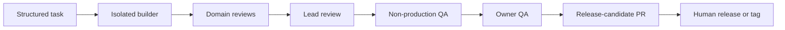

# Codex Mission Control

Codex Mission Control is a local-first orchestration system for turning structured product tasks into isolated Codex builder and reviewer runs, assembling lead-approved work in non-production QA, and preserving human control over releases and production.

It is for developers who want an AI coding workflow to behave more like an accountable engineering team: tasks have acceptance criteria, builders work on separate branches, domain reviewers check the result, a lead makes the final automation decision, and the owner reviews a coherent local QA build instead of chasing individual agents.

> **Project status:** developer preview. Mission Control is useful today on a single developer machine, but its interfaces and data model may still change. Read [Current Limitations](#current-limitations) before relying on it for critical work.

## What It Does

- Captures ideas as epics and buildable tasks with user stories, acceptance criteria, dependencies, attachments, safety rules, and project standards.
- Dispatches builders and backend, frontend, accessibility, and lead reviewers into isolated Git workspaces.
- Records durable runs, prompt snapshots, Codex thread IDs, review outcomes, branch links, PR links, comments, and owner handoffs.
- Uses transactional SQLite with WAL mode so concurrent workers do not overwrite one another.
- Enforces model and reasoning policies per role and raises reasoning for architecture, security, privacy, authentication, data, and deployment work.
- Detects stale workers and stranded tasks through heartbeats, bounded retries, reconciliation, and a watchdog.
- Optionally assembles lead-approved work into a non-production QA branch and refreshes a local preview automatically.
- Promotes owner-approved QA work into a release-candidate PR without pushing directly to the protected branch.
- Keeps production deployment behind an explicit human-controlled release or tag.

## Workflow



Mission Control automates the middle of the process. The human owner remains the authority for product acceptance, protected-branch merges, releases, and production deployment.

## Requirements

- Node.js `22.5` or newer and npm
- Git
- Codex CLI, Codex SDK access, or another supported prompt consumer
- GitHub CLI and repository access for GitHub automation
- macOS for the included always-on LaunchAgent installation

The UI and CLI can be run manually on other platforms supported by Node.js. The packaged background-service installer is currently macOS-only.

## Quick Start

```bash
git clone https://github.com/magic2goodil/codex-mission-control.git
cd codex-mission-control
npm install
npm run setup
npm run dev
```

Open [http://127.0.0.1:4317](http://127.0.0.1:4317).

The setup wizard writes a local `mission-control.config.md`, registers an optional first project, and checks GitHub CLI and SSH readiness. It never asks for or stores private SSH keys.

For a complete first-run walkthrough, GitHub bot setup, manual operation, and always-on installation, see [Getting Started](docs/GETTING_STARTED.md).

## Give This To Codex

Paste this into a new Codex task when you want Codex to install Mission Control for you:

```text
Set up Codex Mission Control from
https://github.com/magic2goodil/codex-mission-control.

Read README.md, docs/GETTING_STARTED.md, and docs/HANDOFF.md first. Install
dependencies, run the interactive setup, register my first project, and verify
the local UI and repository checks. Ask me for project paths and GitHub owner
information when needed. Never ask me to paste private keys, tokens, passwords,
or customer data. Do not enable network access, GitHub bot writes, automatic
merges, releases, or production deployment without explaining the boundary first.
```

Once Mission Control is configured, useful requests include:

```text
Create a task for this in Mission Control and send me the link.
```

```text
Add this to Mission Control, but do not build it yet.
```

```text
Build this through Mission Control.
```

```text
Break this mockup into an epic and buildable Mission Control tasks.
```

The expected task shape and cross-chat handoff rules are documented in [docs/HANDOFF.md](docs/HANDOFF.md).

## Manual Or Always-On

Run the UI and workers individually while evaluating the project:

```bash
npm run dev
npm run automation-tick -- --limit 50
npm run dispatcher -- --plan
npm run runner -- --plan
```

On macOS, install the web UI and worker stack as user LaunchAgents:

```bash
npm run install-agents
npm run status-agents
```

This publishes an immutable runtime under `~/.mission-control/runtime`, keeps a clean self-update checkout under `~/.mission-control/source`, and stores local state in the configured working root. See [Local Automation](docs/LOCAL_AUTOMATION.md) for worker responsibilities, QA preview setup, promotion, status commands, logs, and uninstall instructions.

## GitHub Identities

For automated branch pushes, PRs, comments, and reviews, use a GitHub App instead of a developer's personal identity:

```bash
npm run setup-github-app
```

Separate builder and reviewer identities are also supported:

```bash
npm run setup-github-role-apps
```

Mission Control fails closed when GitHub App authentication is required but unavailable; it does not silently fall back to a personal GitHub identity. See [GitHub App Bots](docs/GITHUB_APP_BOTS.md).

## State And Backups

The authoritative local state is `data/mission-control.sqlite3`. SQLite WAL mode and immediate transactions protect concurrent dispatcher, runner, review, QA, promotion, and notifier writes. Existing JSON state is imported once during migration and is not maintained as a second writable source of truth.

Create a consistent backup while workers are running:

```bash
npm run backup
```

State files, backups, heartbeats, run output, local attachments, credentials, and local configuration are excluded from Git.

## Safety Boundary

By default, Mission Control:

- binds the UI to `127.0.0.1`
- stores state locally with restrictive file permissions
- isolates builders and reviewers in workspaces
- caps routine builder-review loops
- refuses protected branches as QA integration targets
- creates release-candidate PRs instead of pushing to the protected branch
- requires a separate explicit release or tag for production deployment

Do not place secrets, access tokens, private keys, customer data, or unnecessary PII in tasks, comments, attachments, prompts, or logs. Read [SECURITY.md](SECURITY.md) before enabling network access or automation against production repositories.

## Current Limitations

- Mission Control is a local, single-owner control plane, not a hosted multi-user service.
- The web UI does not provide internet-facing authentication. Do not expose it directly to the public internet.
- Always-on worker installation and local notifications currently use macOS LaunchAgents.
- GitHub automation requires GitHub App installation and local credentials configured outside the repository.
- A configured builder can edit code, execute project validation commands, push branches, and open PRs. Review project safety rules before enabling unattended runs.
- Production deployment is deliberately outside Mission Control's automatic worker loop.

## Documentation

- [Getting Started](docs/GETTING_STARTED.md): prerequisites, setup, first project, and operating modes
- [Architecture](docs/ARCHITECTURE.md): components, persistence, runtime, and trust boundaries
- [Codex Workflow](docs/CODEX_WORKFLOW.md): intake, planning, building, review, QA, and ownership
- [Future Chat Handoff](docs/HANDOFF.md): language and task standards for any Codex conversation
- [Review Pipeline](docs/REVIEW_PIPELINE.md): review lanes and bounded change cycles
- [Local Automation](docs/LOCAL_AUTOMATION.md): LaunchAgents, watchdogs, QA integration, and promotion
- [Runner](docs/RUNNER.md): Codex providers, model policy, workspaces, and run recovery
- [GitHub App Bots](docs/GITHUB_APP_BOTS.md): bot identity and least-privilege setup
- [Project Standards](standards/README.md): engineering, design, accessibility, performance, privacy, testing, and release defaults

## Contributing

Issues and pull requests are welcome. Read [CONTRIBUTING.md](CONTRIBUTING.md) before changing workflow state, persistence, authentication, worker execution, or release safeguards. Security issues should follow [SECURITY.md](SECURITY.md), not a public issue.

## License

[MIT](LICENSE)
