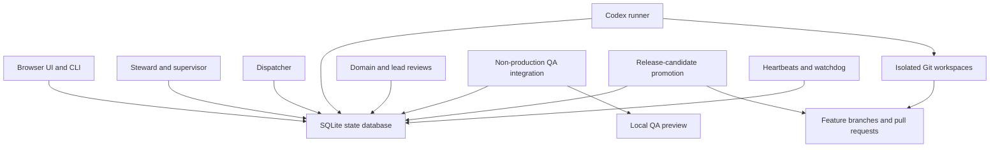

# Architecture

StudioOps is a local-first Node.js control plane with transactional SQLite persistence.

## Components

- `src/server.js`: HTTP server, static file serving, JSON API.
- `src/store.js`: workflow operations and state validation.
- `src/state-database.js`: SQLite schema, migration, transactions, indexes, and storage permissions.
- `src/dispatcher.js`: converts supervisor actions into durable, model-pinned run records.
- `src/runner.js`: claims runs, launches Codex, verifies handoff, bounds retries, and recovers orphaned processes.
- `src/qa-integration.js`: assembles validated non-production QA branches and refreshes local previews.
- `src/promotion.js`: assembles owner-approved work into validated release-candidate PRs.
- `src/runtime-install.js`: atomically publishes worker code outside the source checkout.
- `src/mission-control-cli.js`: CLI for project/task operations and Codex prompts.
- `public/`: browser UI.
- `data/mission-control.sqlite3`: authoritative local database.

## Persistence

SQLite keeps setup friction low without accepting the lost-update and split-state risks of a shared JSON document. WAL mode and `BEGIN IMMEDIATE` transactions serialize simultaneous dispatcher, runner, reviewer, QA, promotion, and notifier writes. Indexed columns support operational task/run queries while each row retains the complete entity payload for forward-compatible fields.

On first startup, an existing `data/mission-control.json` is imported once. The JSON file is not a live mirror and is not written afterward. Use SQLite backup tooling for backups; do not maintain two writable sources of truth.

StudioOps accepts `STUDIOOPS_ROOT`, `STUDIOOPS_DATA_DIR`, and `STUDIOOPS_CONFIG_ROOT`. The corresponding `MISSION_CONTROL_*` variables and legacy database/runtime filenames remain supported for migration safety.

`npm run backup` uses SQLite's online backup API, so it remains consistent while workers are active.

Postgres is a future backend option when StudioOps needs multiple machines or remote team access. Local installations do not need a database daemon.

## Runtime

LaunchAgents execute an immutable release under `~/.mission-control/runtime/releases/`, with `current` swapped atomically. Their working directory still points at the configured working root so the local config and database remain stable. A separate clean `~/.mission-control/source` checkout stays on `main` for self-updates, independent of any developer feature branch. This avoids partial reads from cloud-synced development folders and ensures a restart actually runs the newly installed worker version.

The UI and CLI can run anywhere Node.js is supported. The included always-on service installer, local notification channel, heartbeat scheduling, and worker restart implementation currently target macOS LaunchAgents.

## Safety Gates

Builders create feature PRs. Leads approve work into a non-production QA branch. The owner tests a QA bundle. Promotion creates a release-candidate PR against the protected default branch. Production deployment is only authorized by an explicit release/tag workflow.

## Privacy

StudioOps may contain sensitive project context. By default the server binds to `127.0.0.1`.

The browser UI is not an internet-facing authenticated multi-user application. Do not expose it directly to the public internet. Binding to a LAN address should be limited to a trusted network with host firewall controls.

The data directory is mode `0700`; the database, WAL, shared-memory, and migrated legacy JSON files are mode `0600`. Do not put secrets, API keys, private customer data, or credentials in task descriptions. OAuth credentials and GitHub App private keys remain outside the database and repository.

## Trust Boundaries

- StudioOps state and configuration are trusted local inputs.
- Project repositories and validation commands are executable inputs; register only repositories and commands the owner trusts.
- Codex builders and reviewers are privileged development workers, not sandboxed production services.
- GitHub Apps should have access only to intended repositories and only the permissions documented in `docs/GITHUB_APP_BOTS.md`.
- QA integration is explicitly non-production.
- Promotion may create a PR against the protected target branch but may not merge it.
- Only a separate owner-authorized release or tag may initiate production deployment.
